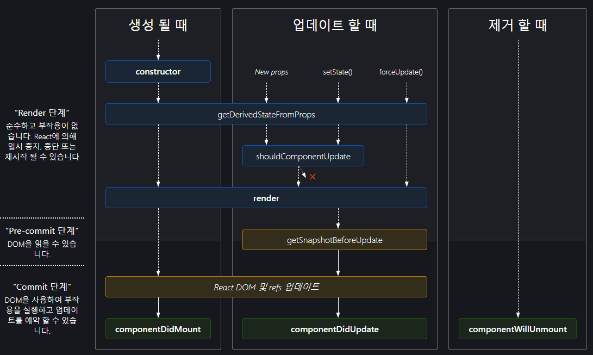

# React의 생명 주기(라이프 사이클)

리액트는 컴포넌트 기반의 View를 중심으로 한 라이브러리입니다. 그러다보니 각각의 컴포넌트에는 라이프 사이클 즉, 컴포넌트의 생명 주기가 존재합니다. 컴포넌트의 생명은 보통 페이지에서 렌더링되기 전인 준비 과정에서 시작하여 페이지에서 사라질 때 끝이 납니다.

<br>



> 위의 이미지는 리액트의 생명 주기를 나타낸 화면입니다. 컴포넌트는 `생성 => 업데이트 => 제거`의 생명 주기를 갖고 있습니다. 아래 목록에서 자주 사용되는 메서드는 `코드블럭` 으로 표시하겠습니다. 나머지는 상대적으로 덜 사용됩니다.

<br>

<br>

## 마운트(생성)

컴포넌트의 [인스턴스](gear-)가 생성되어, DOM에 삽입될 때 순서대로 호출됩니다.

- `constructor()`
- getDerivedStateFromProps()
- `render()`
- `componentDidMount()`

<br>

## 업데이트

props나 state가 변경되면 렌더(갱신)가 진행되며 순서대로 호출됩니다.

- getDerivedStateFromProps()
- shouldComponentUpdate()
- `render()`
- getSnapshotBeforeUpdate()
- `componentDidUpdate()`

<br>

## 마운트 해제(제거)

아래 메서드는 컴포넌트가 DOM에서 제거될 때 호출됩니다.

- `componentWillUnmount()`

<br>

<br>

위에 명시된 자주 사용되는 생명 주기 메서드에 대해 간략한 소개를 하겠습니다.

<br>

<br>

### `render()`

클래스 컴포넌트에서 반드시 구현되어야 하는 유일한 메서드입니다.

- 이 메서드가 호출되면 this.props와 this.state의 값을 활용하여 값을 반환합니다.
- render() 함수는 컴포넌트의 state를 변경하지 않고, 호출될 때마다 동일한 결과를 반환하며 브라우저와 직접적인 상호작용을 하지 않습니다.

<br>

```js
// Class
class Example extends React.Component {
  render() {
    return <div>컴포넌트</div>;
  }
}

// Hooks
const example = () => {
  return <div>컴포넌트</div>;
};
```

> 함수형 컴포넌트에서는 render를 안쓰고 컴포넌트를 렌더링할 수 있습니다.

<br>

### `constructor(props)`

메서드를 바인딩하거나 state를 초기화하는 작업이 없다면 constructor(생성자)가 없어도 됩니다.

- react 컴포넌트의 생성자는 해당 컴포넌트가 마운트되기 전에 호출됩니다.
- 생성자를 구현하면, this.props가 생성자 내에서 정의되도록 super(props)를 호출해야 합니다.
- state의 값을 변경하고자 한다면 constructor() 외부에서 this.setState()를 통해 수정해야 합니다.

<br>

```js
// Class
class Example extends React.Component {
    constructor(props) {
        super(props);
        this.state = { count: 0 };
}

// Hooks
const Example = () => {
    const [count,setCount] = useState(0);
}
```

> 클래스형에서는 초기 state를 정할 때 constructor를 사용해야 합니다. 하지만 훅에서는 useState hook을 사용하면 초기 상태를 쉽게 설정해줄 수 있습니다.

<br>

### `componentDidMount()`

컴포넌트가 마운트된 직후에 호출됩니다.

- DOM 노드가 있어야 하는 초기화 작업이 이루어지면 좋습니다.
- 외부에서 데이터를 불러와야 한다면 네트워크 요청을 보내기 좋은 위치입니다.

<br>

```js
// Class
class Example extends React.Component {
    componentDidMount() {
        ...
    }
}

// Hooks
const Example = () => {
    useEffect(() => {
        ...
    }, []);
}
```

> 함수형 Hooks 에서는 useEffect의 [] 의존성 배열을 비워야지만 똑같은 메소드를 구현할 수 있습니다.

<br>

### `componentDidUpdate()`

갱신(렌더)가 일어난 직후에 호출되며 최초 렌더링에서는 호출되지 않습니다.

<br>

```js
// Class
class Example extends React.Component {
    componentDidUpdate(prevProps, prevState) {
        ...
    }
}

// Hooks
const Example = () => {
    useEffect(() => {
        ...
    });
}
```

<br>

### `componentWillUnmount()`

컴포넌트가 마운트 해제되어 제거되기 직전에 호출됩니다.

- 타이머 제거, 네트워크 요청 취소, componentDidMount()에서 생성된 작업 등을 정리할 때 사용됩니다.
- 실행 직후 컴포넌트는 렌더링되지 않으므로 setState()를 호출하면 안됩니다.

<br>

```js
// Class
class Example extends React.Component {
    coomponentWillUnmount() {
        ...
    }
}

// Hooks
const Example = () => {
    useEffect(() => {
        return () => {
            ...
        }
    }, []);
}
```

> 함수형 컴포넌트에서는 useEffect CleanUp 함수를 통해 해당 메서드를 구현할 수 있습니다.

<br>

---

<br>

## :hammer_and_wrench: 용어 공부

### :gear: 인스턴스

인스턴스(instance)란 객체 지향 프로그래밍(OOP)에서 클래스(class)에 소속된 개별적인 객체를 말합니다. 예를 들어, 사용자(user)라는 클래스를 정의하고 홍길동(hong)이라는 객체를 생성할 경우, hong이라는 객체는 user라는 클래스의 인스턴스가 됩니다. 하나의 클래스를 사용하여 유사한 성질을 가진 수많은 인스턴스를 생성할 수 있습니다. 이 때 추상적인 개념인 클래스에서 실제 객체를 생성하는 것을 인스턴스화(instantiation)한다고 말합니다.

<br>

## 참고

- [blog, 리액트 라이프사이클의 이해](https://kyun2da.dev/react/%EB%A6%AC%EC%95%A1%ED%8A%B8-%EB%9D%BC%EC%9D%B4%ED%94%84%EC%82%AC%EC%9D%B4%ED%81%B4%EC%9D%98-%EC%9D%B4%ED%95%B4/)
- [blog, React Lifecycle(생명주기)](https://kim-mj.tistory.com/250)

- [해시넷, 인스턴스](http://wiki.hash.kr/index.php/%EC%9D%B8%EC%8A%A4%ED%84%B4%EC%8A%A4)
