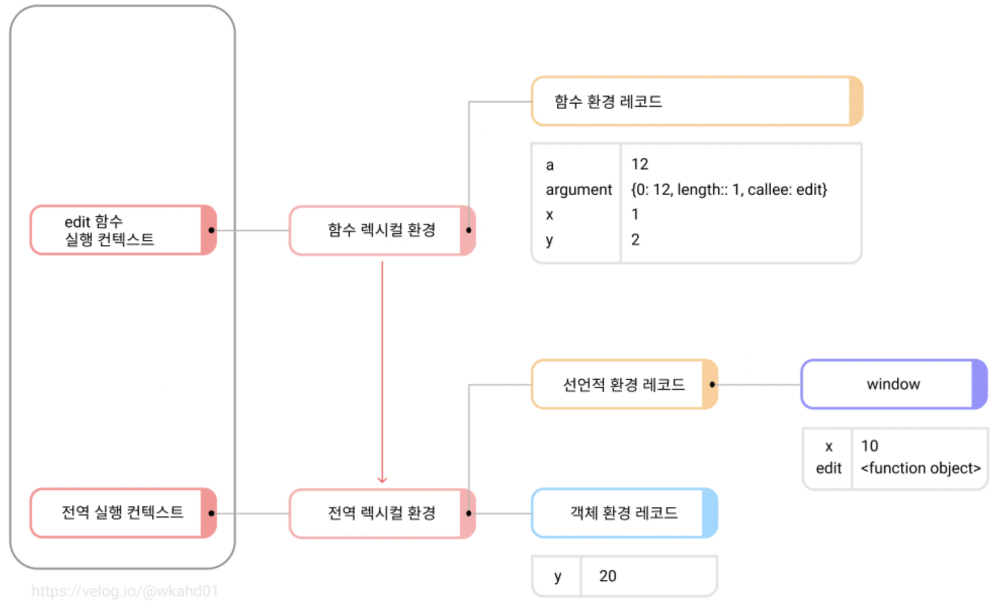

# 실행 문맥(실행 컨텍스트)

```js
var x = 10;
const y = 20;

function edit(a) {
  var x = 1;
  const y = 2;

  return x + y + a;
}
edit(12);
```

<br>



<br>

위와 같은 코드에서의 [실행 컨텍스트](#gear-실행컨텍스트)를 확인하면 다음과 같습니다.

> 1. 전역 실행 컨텍스트 생성/소스코드 실행
>
> - var로 선언한 전역 변수는 객체 환경 레코드에 저장됨.
> - const, let으로 선언한 전역 변수는 선언적 환경 레코드에 저장됨.
> - edit 함수 실행 컨텍스트 생성/소스코드 실행
>
> 2. 전역 환경 레코드와 달리 함수 환경 레코드는 분리되지 않고, 한 장소에서 var,const,let 모두를 처리한다.
>
> - 추가로 알아야 하는 것들:

실행 컨텍스트들은 실행 컨텍스트 스택에 하나씩 쌓이고 사라진다.
소스코드 평가 과정에서는 선언문이 실행되고, 스코프에 등록된다.
소스코드 실행 과정에서는 변수에 값이 할당되고 함수가 호출된다.

<br>

---

<br>

## :hammer_and_wrench: 용어 공부

### :gear: 실행컨텍스트

- TypeScript의 가장 독특한 특징은 정적 타이핑을 지원한다는 것입니다. 정적 타입 언어는 타입을 명시적으로 선언하며, 타입이 결정된 후에는 타입을 변경할 수 없습니다. 잘못된 타입의 값이 할당 또는 반환되면 컴파일러는 이를 감지해 에러를 발생시킵니다.

- 자바스크립트는 동적 타입(dynamic typed) 언어 혹은 느슨한 타입(loosely typed) 언어입니다. 이것은 변수의 타입 선언 없이 값이 할당되는 과정에서 동적으로 타입을 추론(Type Inference)한다는 의미입니다. 동적 타입 언어는 타입 추론에 의해 변수의 타입이 결정된 후에도 같은 변수에 여러 타입의 값을 교차하여 할당할 수 있습니다. 이를 동적 타이핑(Dynamic Typing)이라 합니다. 동적 타이핑은 사용하기 간편하지만 코드를 예측하기 힘들어 예상치 못한 오류를 만들 가능성이 높습니다. 또한 IDE와 같은 도구가 변수나 매개 변수, 함수의 반환값의 타입을 알 수 없어 코드 어시스트 등의 기능을 지원할 수 없게 합니다.

<br>

## 참고

- [blog, 프론트엔드 면접 문제 은행](https://velog.io/@wkahd01/%ED%94%84%EB%A1%A0%ED%8A%B8%EC%97%94%EB%93%9C-%EB%A9%B4%EC%A0%91-%EB%AC%B8%EC%A0%9C-%EC%9D%80%ED%96%89-HTML-%EC%A7%88%EB%AC%B8-%EB%8B%B5%EB%B3%80#%EC%8B%A4%ED%96%89-%EB%AC%B8%EB%A7%A5%EC%8B%A4%ED%96%89-%EC%BB%A8%ED%85%8D%EC%8A%A4%ED%8A%B8)
- [poiemaweb, 정적 타이핑](https://poiemaweb.com/typescript-typing)
